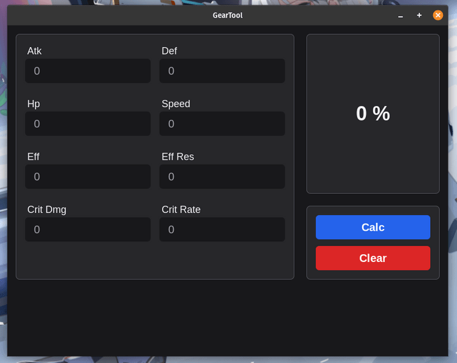

# gearTool
Epic Seven is a mobile-based RPG from Smilegate.

### Limitation
- Support epic gear only.
- Support T6(lvl 72 - 85) gear only.
- Does not support flat substat gear.

+15 enhancement gear is supposed to have 5 rolls, if you encountered a roll that is less than 5,  then use the score percentage only.

### Formula
It used the 8 Golden Rule Standard:

| Sub Stat                  | Rate
| ------------------------- | -------------
| Hp/Atk/Eff/Eff-Res/Def    | 1
| Crit Dmg                  | 1.14
| Crit Rate                 | 1.6
| Speed                     | 2

### Result
| Score Percentage | Gear Category
| ---------------- | -------------
| 80% - 100%       | Godly Gear
| 75% - 79%        | Good Gear
| 70% - 74%        | Normal Gear
| 69% - 0%         | Trash Gear

## Stack
It is created using those amazing technologies:
- [Vue](https://vuejs.org/)
- [Tailwind](https://tailwindcss.com/)
- [Tauri](https://tauri.studio/en/)
- And many others!

## License
>You can check out the full license [here](https://github.com/hafizhaziq307/gearTool/blob/main/LICENSE)

This project is licensed under the terms of the **MIT** license.
.
